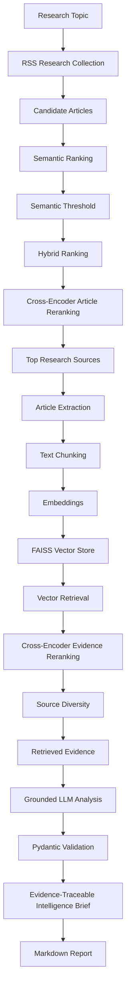

# AI Research Intelligence Agent

An end-to-end AI research and strategic intelligence system that collects live technology research, ranks sources using multi-stage retrieval, builds a RAG knowledge base, and generates evidence-grounded intelligence briefs with traceable source attribution.

The project combines semantic search, hybrid ranking, cross-encoder reranking, FAISS vector retrieval, structured LLM analysis, and human-labeled retrieval evaluation.

---

## Overview

Research workflows often require reviewing large numbers of articles before identifying the small subset that is actually relevant to a specific question.

The AI Research Intelligence Agent automates this process through a multi-stage retrieval and analysis pipeline.

Given a research topic, the system:

1. Collects recent articles from multiple technology sources.
2. Filters candidates using semantic similarity.
3. Combines semantic relevance, keyword matching, and recency.
4. Reranks candidates using a cross-encoder.
5. Extracts and chunks the most relevant articles.
6. Builds a FAISS vector knowledge base.
7. Retrieves and reranks evidence chunks.
8. Applies source diversity to reduce evidence duplication.
9. Generates a structured strategic intelligence brief using an LLM.
10. Links key findings back to the retrieved evidence.
11. Saves the final report as Markdown.

The retrieval system is evaluated using manually labeled relevance judgments rather than relying only on qualitative inspection.

---

## Architecture



---

## Retrieval Pipeline

The system uses multiple retrieval stages instead of relying on a single similarity score.

### 1. Research Collection

Recent articles are collected from RSS feeds including:

- TechCrunch AI
- Google AI
- Hugging Face

Duplicate URLs and articles outside the configured lookback period are removed.

### 2. Semantic Ranking

Article titles and summaries are compared with the research query using semantic embeddings.

Only candidates above the configured semantic relevance threshold continue through the pipeline.

### 3. Hybrid Ranking

Semantic relevance is combined with two additional signals:

- keyword relevance
- publication recency

The current hybrid score is:

```text
70% semantic similarity
25% keyword relevance
 5% recency
```

This provides a broader ranking signal than keyword matching or embedding similarity alone.

### 4. Cross-Encoder Article Reranking

The highest-ranking article candidates are evaluated using a cross-encoder:

```text
cross-encoder/ms-marco-MiniLM-L6-v2
```

Unlike independent embedding similarity, the cross-encoder evaluates the query and document together to produce a stronger relevance signal.

---

## RAG Pipeline

After source selection, the system builds a temporary knowledge base for the research topic.

### Article Extraction

Full article content is extracted from the highest-ranked sources.

### Chunking

Article text is divided into smaller evidence chunks suitable for retrieval.

### Vector Search

Chunks are embedded and indexed using FAISS.

The research query retrieves a broader candidate pool from the vector index.

### Evidence Reranking

Retrieved chunks are reranked using a cross-encoder before being passed to the language model.

### Source Diversity

A source-diversity step limits how many chunks from a single article can appear in the final context.

This prevents one source from dominating the evidence supplied to the model.

---

## Evidence-Grounded Analysis

The final language-model stage is instructed to analyze only the retrieved evidence.

The generated intelligence brief contains:

### Executive Summary

A concise summary of the most important evidence-grounded developments.

### Key Developments

Each development contains:

- a short title
- an evidence-grounded finding
- explicit evidence references such as `E1`, `E3`, or `E6`

Example:

```text
Persistent Memory for Coding Agents

Coding agents can use indexed session traces to recover
previous decisions and reasoning across sessions.

Evidence: E3, E6
```

### Strategic Implications

Interpretations derived from the retrieved evidence while remaining separate from factual findings.

### Risks & Limitations

Identifies uncertainty, evidence gaps, operational limitations, or weaknesses in the available research.

### What to Watch Next

Signals and developments worth monitoring based on the current evidence.

### Confidence

The model provides a `High`, `Medium`, or `Low` confidence assessment together with an explanation.

---

## Evidence Traceability

A major design goal of the system is making generated intelligence traceable.

Retrieved chunks are assigned evidence identifiers:

```text
E1
E2
E3
...
```

Key developments must reference one or more valid evidence IDs.

The generated Markdown report also contains an Evidence Register connecting each identifier to:

- article title
- publisher/source
- original URL
- vector similarity score

This creates a traceable path:

```text
Generated Finding
       ↓
Evidence ID
       ↓
Retrieved Chunk
       ↓
Original Article
```

---

## Retrieval Evaluation

The retrieval pipeline includes a manually labeled benchmark.

For each benchmark query, the Top-5 retrieved chunks were manually classified as either relevant or not relevant.

The system is evaluated using standard information-retrieval metrics.

### Current Benchmark

| Metric | Result |
|---|---:|
| Precision@5 | 0.680 |
| Mean Reciprocal Rank (MRR) | 1.000 |
| Mean nDCG@5 | 1.000 |
| Queries Evaluated | 5 |

### Metric Interpretation

**Precision@5** measures the proportion of the first five retrieved results that were manually judged relevant.

A score of `0.680` means that, on average, 68% of the Top-5 retrieved chunks were relevant across the benchmark queries.

**Mean Reciprocal Rank (MRR)** measures how early the first relevant result appears.

An MRR of `1.000` means a relevant result appeared at Rank 1 for every evaluated query.

**nDCG@5** evaluates whether relevant results are placed near the top of the ranking.

The current benchmark produced a mean nDCG@5 of `1.000`.

These results are based on a small five-query benchmark and should be interpreted as an initial retrieval baseline rather than a general measure of system accuracy.

---

## Automated Testing

The project includes automated regression tests for deterministic components of the pipeline.

Current test suite:

```text
18 passed
```

Tests cover areas including:

- keyword relevance scoring
- text normalization
- recency scoring
- hybrid ranking
- source diversity
- Precision@K
- Reciprocal Rank
- nDCG@K

Run the tests with:

```powershell
$env:PYTHONPATH="src"
pytest -v
```

---

## Tech Stack

### Language

- Python

### Retrieval & NLP

- Sentence Transformers
- Cross-Encoder reranking
- FAISS
- Semantic embeddings
- Hybrid retrieval

### AI Analysis

- Hugging Face model inference
- Qwen instruction model
- Retrieval-Augmented Generation (RAG)

### Data & Validation

- Pydantic
- JSON structured outputs

### Research Collection

- RSS
- Feedparser
- Article text extraction

### Engineering

- Pytest
- Git
- GitHub
- Environment-based secret management

---

## Project Structure

```text
ai-research-intelligence-agent/
│
├── src/
│   ├── main.py
│   ├── config.py
│   ├── collector.py
│   ├── semantic_ranker.py
│   ├── hybrid_ranker.py
│   ├── reranker.py
│   ├── article_extractor.py
│   ├── chunker.py
│   ├── vector_store.py
│   ├── rag_pipeline.py
│   ├── rag_analyzer.py
│   ├── analyzer.py
│   ├── models.py
│   ├── reporter.py
│   ├── generate_benchmark.py
│   ├── label_benchmark.py
│   └── evaluate_benchmark.py
│
├── tests/
│   ├── test_collector.py
│   ├── test_hybrid_ranker.py
│   ├── test_rag_pipeline.py
│   └── test_evaluation.py
│
├── reports/
├── evaluation_benchmark.json
├── requirements.txt
├── .env.example
├── .gitignore
└── README.md
```

---

## Installation

Clone the repository:

```bash
ggit clone https://github.com/aIjory/ai-research-intelligence-agent.git
```

Create a virtual environment:

```bash
python -m venv .venv
```

Activate it on Windows:

```powershell
.venv\Scripts\Activate.ps1
```

Install dependencies:

```bash
pip install -r requirements.txt
```

---

## Environment Variables

Create a `.env` file using `.env.example` as the template.

Never commit API tokens or other credentials to Git.

The repository's `.gitignore` excludes `.env`.

---

## Running the Agent

Run:

```bash
python src/main.py
```

Then enter a research topic:

```text
What topic would you like to research? autonomous coding assistants
```

The pipeline will collect and rank sources, build the RAG knowledge base, retrieve supporting evidence, generate the intelligence analysis, and save the final report inside:

```text
reports/
```

---

## Example Pipeline Output

A typical run includes:

```text
Collected 240 unique recent articles.
Semantic ranking 100 candidate articles...
10 articles passed the semantic relevance threshold.
Hybrid ranking produced 10 candidates.
Cross-encoder reranking 10 candidates...

Building RAG knowledge base...
Total chunks in knowledge base: 46
FAISS retrieved 21 candidate chunks.
Reranking 21 evidence chunks...
Selected 8 diverse evidence chunks.

Analyzing retrieved evidence with AI...
```

The resulting report contains evidence-backed key developments with references such as:

```text
Evidence: E1, E2
```

allowing findings to be traced back to retrieved source material.

---

## Design Decisions

### Why Multi-Stage Retrieval?

Embedding similarity alone can return conceptually related but weakly relevant documents.

The system therefore combines several signals:

```text
Semantic retrieval
        ↓
Hybrid scoring
        ↓
Cross-encoder reranking
```

The RAG stage applies another retrieval and reranking process at the chunk level.

### Why Separate Retrieval From Generation?

The language model does not search the entire research corpus directly.

Instead, retrieval determines the evidence set first, and the LLM is instructed to reason only over that evidence.

This separation makes retrieval quality measurable independently from generation quality.

### Why Human Relevance Labels?

Retrieval quality cannot be reliably evaluated by simply asking the same language model whether its own results are good.

The benchmark therefore stores manual relevance judgments and calculates information-retrieval metrics from those labels.

---

## Limitations

The current evaluation benchmark contains only five queries, so the reported metrics should be treated as an initial baseline.

RSS feeds also constrain the research corpus to the configured publishers and their available feed history.

Semantic similarity and cross-encoder scores represent retrieval relevance rather than factual correctness.

The final strategic analysis is generated by a language model. Evidence grounding reduces unsupported generation but does not guarantee that every interpretation is correct.

The system should therefore be used as a research-assistance tool rather than an authoritative source of truth.

---

## Future Work

Potential extensions include:

- expanding the human-labeled evaluation dataset
- comparing retrieval configurations through controlled experiments
- additional research sources
- persistent vector indexes
- query expansion
- improved article extraction
- automated citation verification
- FastAPI service layer
- Docker containerization
- scheduled research runs
- Slack or Notion delivery
- cloud deployment

---

## Status

**v1.0 — Core research, RAG, evaluation, and evidence-traceability pipeline complete.**
